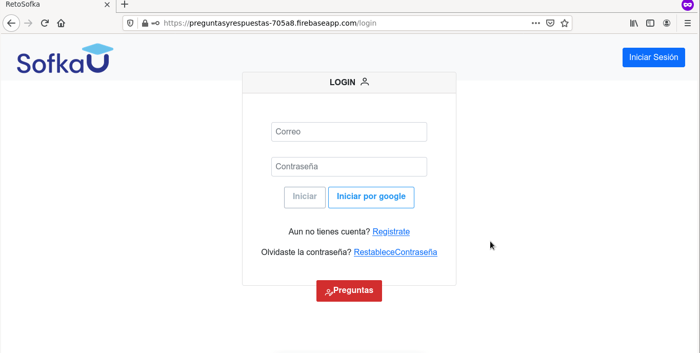
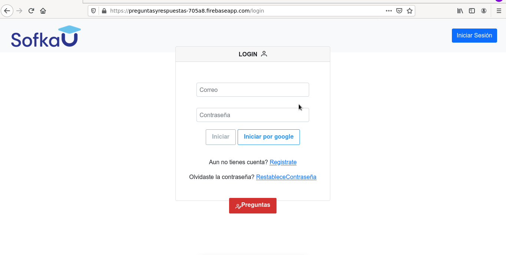
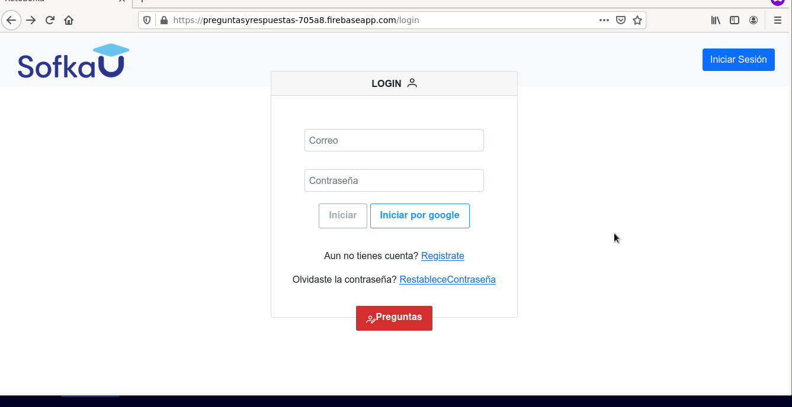
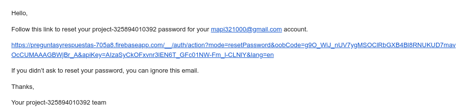
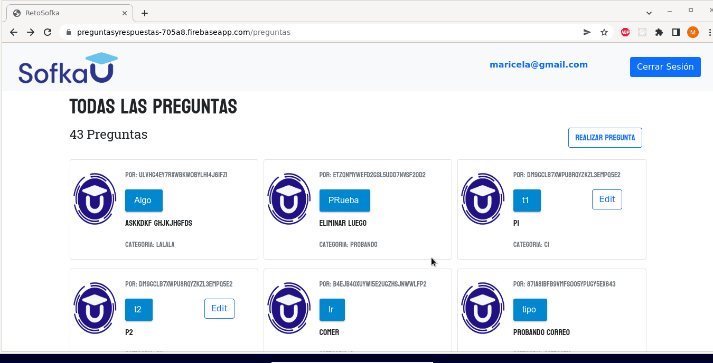
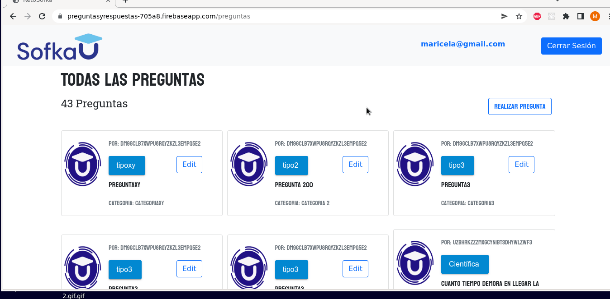
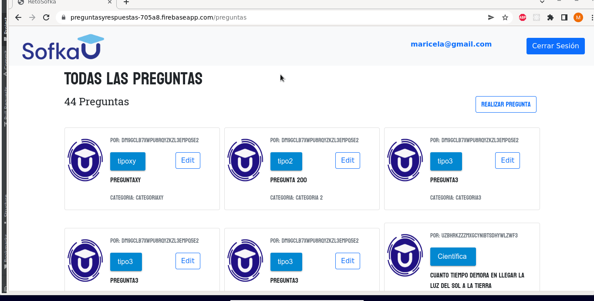
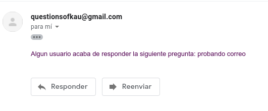

# -reto-training-intermedio-practica-personal
#### link del reto: https://preguntasyrespuestas-705a8.firebaseapp.com/login
#### backend : https://reto-training-sofka.herokuapp.com/
### Requerimientos hechos:

### Se realizó autenticación con el uso del aplicativo firebase:
### Registro

### Iniciar y cerrar sesión

### Restablecer contraseña

### Respuestas:
#### Se permite agregar respuestas a las preguntas de la aplicación, editar al usuarios sus respuestas, y calificar las respuestas de 1 a 5, las cuales se ordenan de forma descendente de la respuesta con el mejor promedio de calificación a la de menor.

### Paginador:

#### Se hace paginador de  10 preguntas por cada  página.

### Crear y editar peguntas

####  Cuando alguien responde una de las preguntas, el usuario que la formuló recibe la siguiente notificación al correo:

